# Syteup

**Syteup** (a complete rewrite of [Syte](https://github.com/rigoneri/syte)) is a
really simple but powerful packaged personal site that has social integrations
like GitHub, Dribbble, Instagram, Tumblr, Wordpress,
Linkedin, Last.fm, SoundCloud, Bitbucket, StackOverflow, Flickr.

# Demo

You can see Syteup in action on [my personal website](http://lejenome.github.io/).

A more up to date but less stable version is available
[here](http://lejenome.github.io/syteup/demo).

## Social Integrations

### Blog

Syteup use [Tumblr](http://tumblr.com), [Wordpress.com](http://wordpress.com/)
or [Blogger](https://www.blogger.com/) for blogging and your blog will be the
primary page of the site.


### Social Services

Suteup currently support many different social services:

**[Github](https://github.com/)**

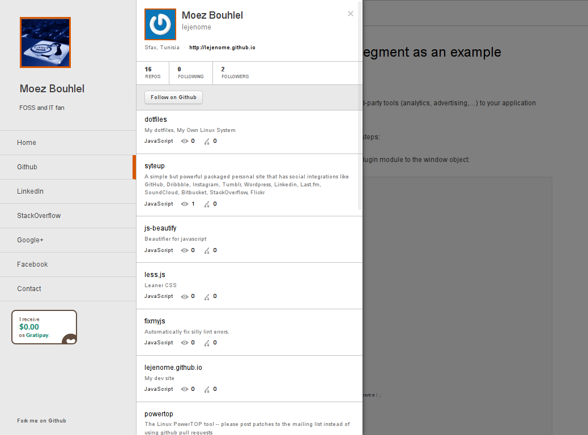

**[Flickr](https://www.flickr.com/)**

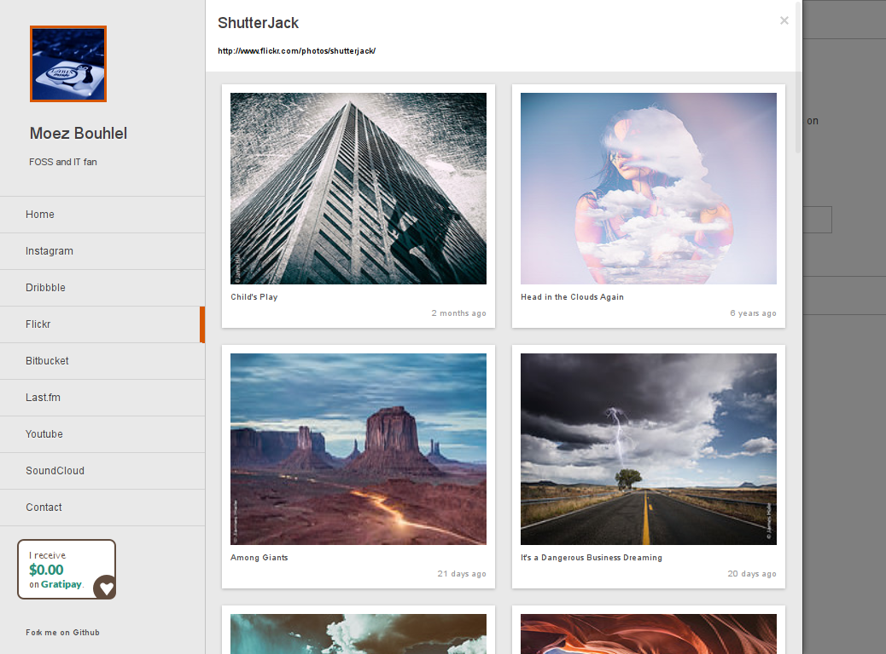

**[SoundCloud](https://soundcloud.com/)**

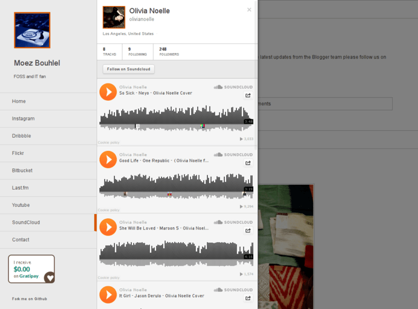

**[Last.fm](http://www.last.fm/)**


**[StackOverflow](http://stackoverflow.com/)**

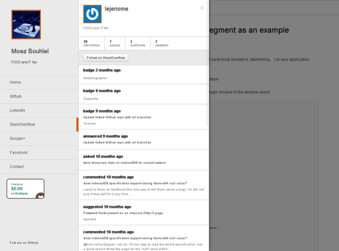

**[Bitbucket](https://bitbucket.org/)**

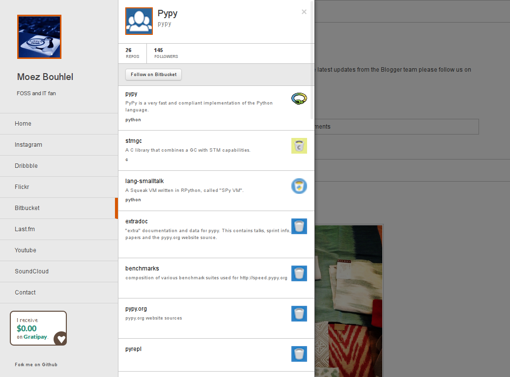

**[Dribbble](https://dribbble.com/)**

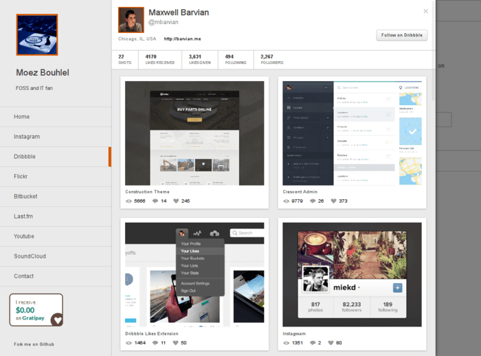

**[Instagram](http://instagram.com/)**

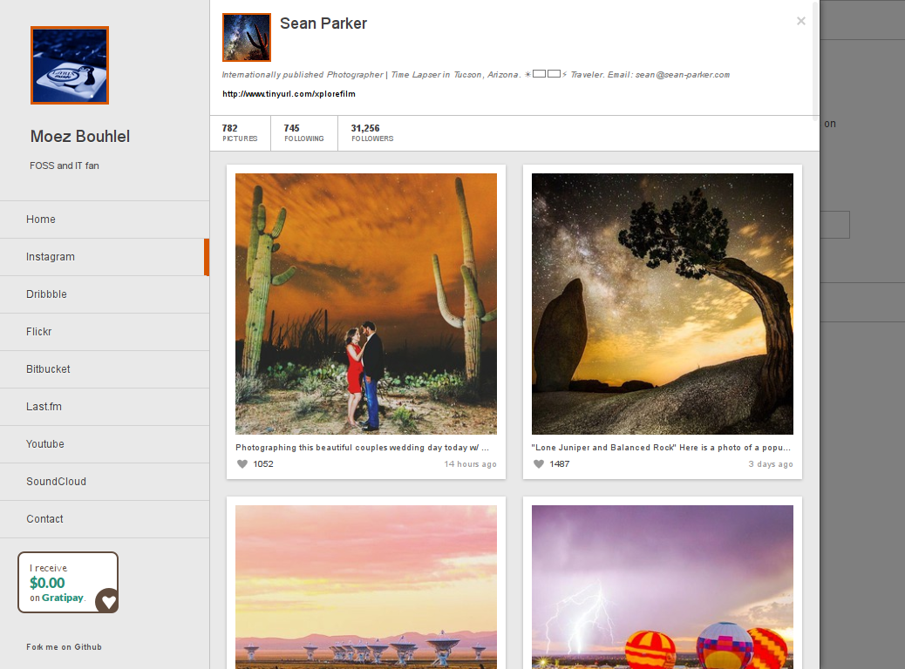

**[Youtube](https://www.youtube.com/)**

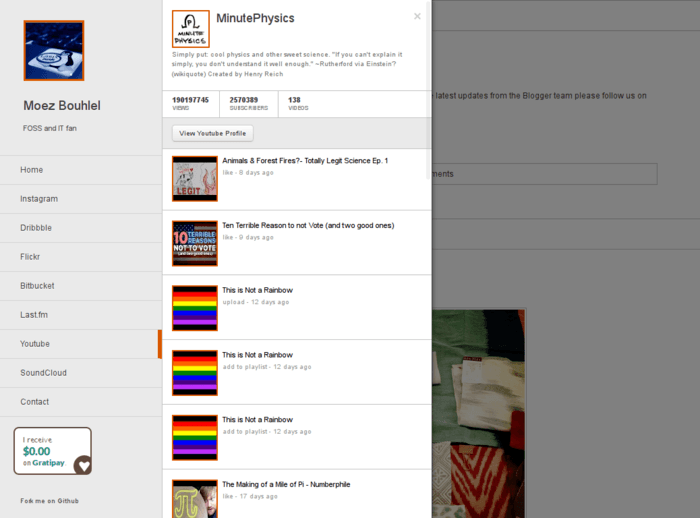

**[LinkedIn](https://www.linkedin.com/)**

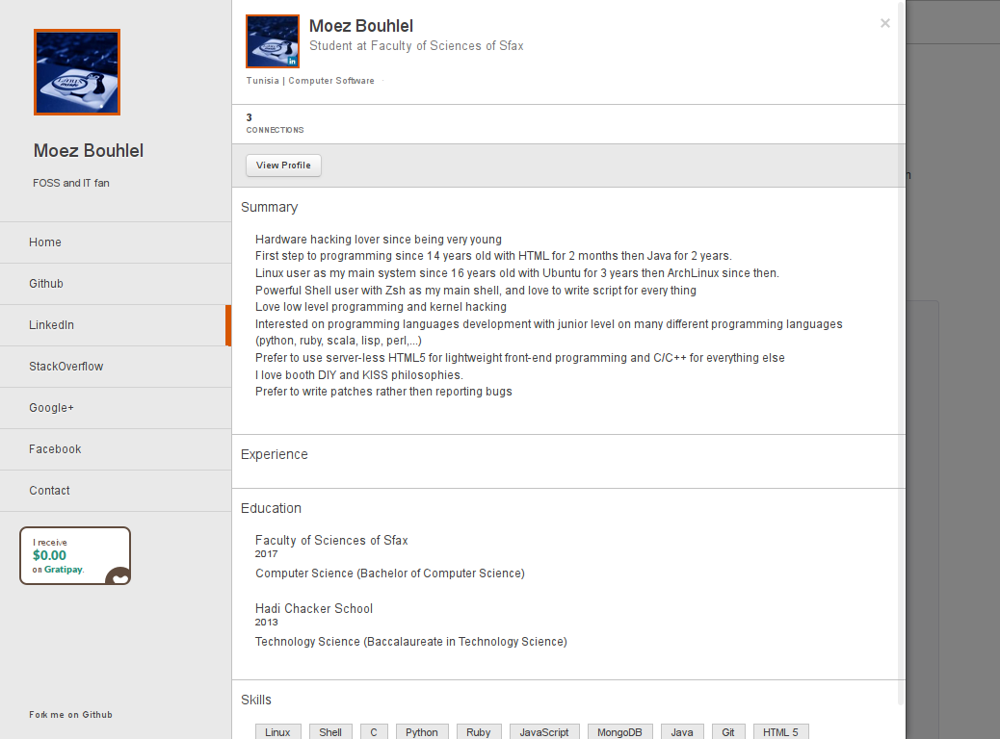

**[Facebook](https://www.facebook.com/)**

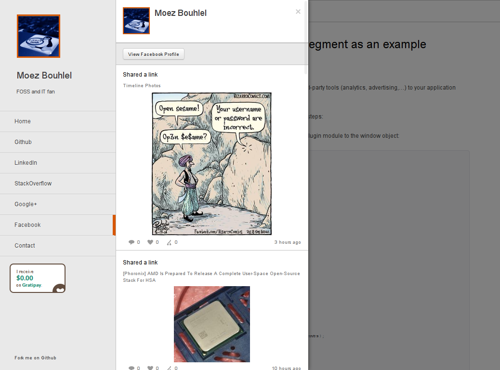

**[Google+](https://plus.google.com/)**

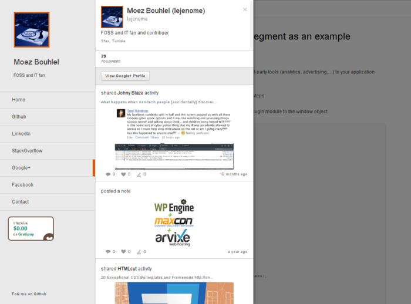

Some other services integration is planed. For more up to date list of currently
supported services and planed services isavailable on
[TODO.md](https://github.com/lejenome/syteup/tree/master/TODO.md) file.

NOTE: Some services can not be supported as accessing them from client side will
give crackers full access to your account (e.g: Twitter, Foursquare) or the service provider does not support
server side requirements (e.g: neither SOP nor jsonp are supported by Steam,...),
if you want them to be implemented, ask the service provider to supported limited
permission access tokens or other needed requirements.

## Installation

Syteup dose not require  any specific server side future as it is server-less
moder HTML5 webapp.

First, you need to setup Syteup requirements by runnig the following commands:
```shell
npm install
bower update
```
then, you needs to rename
[src/config.json.sample](https://github.com/lejenome/syteup/tree/master/src/config.json.sample)
file to `config.json` and customize it for your needs as explained on the
flowing section then run
```shell
npm run dist
```
which will update the
[dist/](https://github.com/lejenome/syteup/blob/master/dist/)
folder with your new settings. Then copy the contents of [dist/](https://github.com/lejenome/syteup/blob/master/dist/)
folder to you server and then everything is ready.

You can also use make command for custom src and dist folder and config file
too.
```shell
make -j1 SRC=~/syteup/src DIST=/srv/website/www CONF=~/my_config.json
```

## Setup

**IN PROGRESS**

### General Setup


Change all avatars images on [src/imgs](src/imgs) folder (pic.png, favicon.ico,
apple-touch-icon\*.png) by your avatar images with same sizes.

Setup the options of `fields` object on `config.json` file

```javascript
"fields": {
  "username": String, // the pseudonym (nickname) you mostly known by
  "realname": String, // your complete real name
  "description": String, // a very short 'About Me' line
  "url": String, // the url of your website
  "contact": {
    "email": String, // your email
    "mobile": String, // [optional] your phone number e.g: (216) 00000000
    "tel": String, // [optional] your telephone number e.g: (216) 00000000
    "fax": String, // [optional] your fax number e.g: (216) 1111111
    "address": String, // [optional] just a short address e.g: Texas, USA
    "pgp_url": String, // [optional] url of your public pgp key file on your site e.g: /pubkey.asc
    "fingerprint": String, // [optional] your pgp key fingerprint e.g: 3A1D ADDD 332D 2EFB F816  21C3 84D8 5721 7365 9C9D
    "ssh_url": String // [optional] your ssh public certificate file url on your site e.g: /id_rsa.pub
  }
```

### Blog Setup

Set `blog_platform` to the bloggin platform that you will use, availbale platforms
are **"tumblr"** and **"blogger"** and **"wordpress"**.

Next, you need to setup the options of the choosen platform on the
`blogs_settings.<platform_name>` object as follow:

#### Wordpress

```javascript
"wordpress": {
  "blog_url": String, // the url of your wordpress.com blog
  "tag_slug": String // [optional] tags of posts to import (space separated)
}
```

#### Blogger

```javascript
"blogger": {
  "blog_url": String, // your blog url
  "blog_id": String, // your blog id number (you can use https://developers.google.com/apis-explorer/#p/blogger/v3/blogger.blogs.getByUrl)
  "api_key": String, // your api key (See Below)
  "tag_slug": String // [optional] tags of posts to import (comma separated)
}
```
Steps to get your `api_key` are explained on the youtube section below.

#### Tumblr

```javascript
"tumblr": {
  "blog_url": String, // your blog url
  "api_key": String, // your api key (See Below)
  "tag_slug": String // [optional] tag of posts to import (just one tag)
}
```
To get your `api_key`, register a new app [here](https://www.tumblr.com/oauth/register)
with any name and your website url as the default callback url. The "OAuth
Consumer Key" of the application is your `api_key`.

### Services Setup

For every service you would to enable, you should set `services.<service_name>` on
`config.json` file to `true` and setup it options object
`services_settings.<service_name>` on same file.

Disabled services can safely removed from booth `services` and
`services_settings` objects on the config file.

#### Github

enable `services.github` and configure `services_settings.github` as follow:
```javascript
"github": {
  "username": String // your username
}
```

#### StackOverflow

enable `services.stackoverflow` and configure `services_settings.stackoverflow` as follow:
```javascript
"stackoverflow": {
  "username": String, // your username
  "user_id": String // your user id number
}
```

#### Flickr

enable `services.flickr` and configure `services_settings.flickr` as follow:
```javascript
"flickr": {
  "username": String, // your username
  "user_id": String // your user id (you can get it from http://idgettr.com/)
}
```

#### Bitbucket

enable `services.bitbucket` and configure `services_settings.bitbucket` as follow:
```javascript
"bitbucket": {
  "username": String, // your username
  "show_forks": Boolean // show number of forks (It require a http request for every repository
}
```

#### SoundCloud

enable `services.soundcloud` and configure `services_settings.soundcloud` as follow:
```javascript
"soundcloud": {
  "username": String, // your username
  "client_id": String, // your client_id (See Below)
  "show_artwork": Boolean, // show tracks artworks
  "player_color": String // color of tracks player
}
```
To get an `client_id`, register an app [here](http://soundcloud.com/you/apps)
with any name you want, after you accept their Developer Policies, you get your
Client ID.

#### Last.fm

enable `services.lastfm` and configure `services_settings.lastfm` as follow:
```javascript
"lastfm": {
  "username": String, // your username
  "api_key": String // your api key (See Below)
}
```
To get an `api_key`, register a non comercial account
[here](http://www.last.fm/api/account/create) with any name and a small
description, then you will get your API Key.

#### Dribbble

enable `services.dribbble` and configure `services_settings.dribbble` as follow:
```javascript
"dribbble": {
  "username": String // your username
}
```

#### Youtube

enable `services.youtube` and configure `services_settings.youtube` as follow:
```javascript
"youtube": {
  "username": String, // your username
  "api_key": String // your api key (See Below)
}
```
To get an `api_key`, create a project
[here](https://console.developers.google.com/) with any name then click "Enable
an API" and enable the API you need ("YouTube Data API v3" for YouTube,
"Blogger API v3" for Blogger, "Google+ API" for Google+). Then on "Cendentials"
tab, click "Create a new Key" then "Browser Key" and enter your website url then
"Create" to get your API KEY.

#### Google+

enable `services.gplus` and configure `services_settings.gplus` as follow:
```javascript
"gplus": {
  "user_id": String, // your user id number
  "api_key": String // your api key (See Below)
}
```
Steps to get your `api_key` are explained on the youtube section above.

#### Facebook

enable `services.facebook` and configure `services_settings.facebook` as follow:
```javascript
"facebook": {
  "username": String, // your username
  "access_token": String // your access token key (See Below)
}
```
to get you read only `access_token`, create a web application
[here](https://developers.facebook.com/quickstarts/?platform=web). Then, choose
it from "Application" menu from this
[page](https://developers.facebook.com/tools/explorer/) and click "Get Access
Token" and select booth "user_activities", "user_about_me" and "user_status".
After confirming, you will get your final `access_token` on the Access Token
field.

#### Instagram

enable `services.instagram` and configure `services_settings.instagram` as follow:
```javascript
"instagram": {
  "username": String, // your username
  "access_token": String, // your access token key (TODO: NEED MORE DOCUMENTATION)
  "user_id": String // your user id number
}
```

#### LinkedIn

enable `services.linkedin` and configure `services_settings.linkedin` as follow:
```javascript
"linkedin": {
  "username": String, // your username
  "access_token": String // your access token key (See Below)
}
```
To get your read only `access_token`, register a new app
[here](https://www.linkedin.com/secure/developer). Select "r_basicprofile" and
"r_fullprofile" as your default scopes and add
`http://lejenome.me/tests/syteup-settings/linkedin.html?client_id=<YOUR_API_KEY>&client_secret=<YOUR_SECRET_API>`
to "OAuth 2.0 Redirect URLs" after replacing the two parameters with your
API Key and your Secret Key. Then use this
[link](http://lejenome.me//tests/syteup-settings/linkedin.html) to request your access token.

### Plugins setup

Enabling a plugin depend on the type of plugin, either it's a generic plugin or
a blog plugin. For generic plugins, set `plugins.<plugin_name>` to `true`. and
for blogs plugins, set `blogs_settings.plugins.<plugin_name>` to `true`.

Settings of every plugin are availbale on the `plugins_settings.<plugin_name>`
object on `config.json` file as follow:

#### Disqus

This plugin will enable disqus comments on every post. Just
enable `blogs_settings.plugins.disqus` and configure `plugins_settings.disqus` as follow:
```javascript
"disqus": {
  "url": String, // [optional] your disqus profile url
  "shortname": String, // your username
  "just_count": Boolean // [optional] just show the number of comments instead of the 'Show Comments' buttons
}
```

#### ShareThis

This plugin will add ShareThis widget to every post. Just
enable `blogs_settings.plugins.sharethis` and configure `plugins_settings.sharethis`
as follow:
```javascript
"sharethis": {
  "publisher_key": String // your key
}
```

#### RSS

This plugin will add RSS entry that any browser can subscribe to. Just
enable `plugins.rss` and configure `plugins_settings.rss` as follow:
```javascript
"rss": {
  "url": String // the url of your rss feed file or an external rss feed from your blog platform
}
```

#### Google Analytics

This plugin will enable Google Analytics tracking. Just
enable `plugins.google_analytics` and configure `plugins_settings.google_analytics`
 as follow:
```javascript
"google_analytics": {
  "tracking_id": String // your tracking id e.g: UA-XXXXXXX-2
}
```

#### Woopra

This plugin will enable Woopra tracking. Just
enable `plugins.woopra` and configure `plugins_settings.woopra` as follow:
```javascript
"woopra": {
  "tracking_domain": String, // TODO
  "idle_timeout": Number, // TODO
  "include_query": Boolean // TODO
}
```

#### Segment

This plugin will enable Segment services. Just
enable `plugins.segment` and configure `plugins_settings.segment` as follow:
```javascript
"segment": {
  "write_key": String // your write key
}
```

#### Gratipay Widget

This plugin will add Gratupay widget bollow the navigation menu. Just
enable `plugins.gratipay_widget` and configure `plugins_settings.gratipay_widget`
as follow:
```javascript
"gratipay_widget": {
  "username": String // your gratipay username
}
```

## Credit

[Syteup](https://github.com/lejenome/syteup) is developed by
[lejenome](https://github.com/lejenome) ([Moez Bouhlel](http://lejenome.github.io/))
based on [Syte](https://github.com/rigoneri/syte) by [Rigo](https://github.com/rigoneri)
(rodrigo neri).
Thanks to [The Contributors](https://github.com/lejenome/syteup/graphs/contributors)
for booth the old Syte code and Syteup code.

## Licence

This program is free software; it is distributed under the MIT Licence.

Copyright (c) 2014, Moez Bouhlel (bmoez.j@gmail.com) & [The
Contributors](https://github.com/lejenome/syteup/graphs/contributors)


[](https://bitdeli.com/free "Bitdeli Badge")
[](https://coveralls.io/r/lejenome/syteup)
[](https://gemnasium.com/lejenome/syteup)
